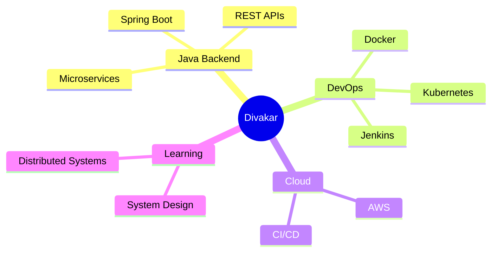

 

  
  

  
  

  

 

  

  
  
  

  

### CORE FOCUS

`Spring Boot` &nbsp; `REST APIs` &nbsp; `Microservices` &nbsp; `DevOps` &nbsp; `Cloud Infrastructure`

### CURRENTLY LEARNING

`Kubernetes` &nbsp; `System Design` &nbsp; `CI/CD Pipelines` &nbsp; `Distributed Systems`

 

 

  

  

 

### :briefcase: Zoho Corporation Pvt. Ltd.

#### Project Trainee &mdash; Backend Development

  

:heavy_check_mark: Worked on backend application development using Java  
:heavy_check_mark: Contributed to API development & database interactions  
:heavy_check_mark: Worked in Agile development environment  
:heavy_check_mark: Participated in debugging, testing & feature enhancement  
:heavy_check_mark: Followed enterprise coding standards & clean architecture

 

 

 

### :zap: Priority-Aware Smart HPA

#### Intelligent Kubernetes Autoscaler

:small_blue_diamond: Custom autoscaling mechanism  
:small_blue_diamond: Priority-aware scaling algorithm  
:small_blue_diamond: Optimized cluster resource utilization  
:small_blue_diamond: Production-style microservice simulation

#### :hammer_and_wrench: Stack

 

 

 

### :building_construction: KK-Builders Platform

#### Enterprise MERN Platform

:small_blue_diamond: Construction portfolio management  
:small_blue_diamond: REST APIs & admin workflows  
:small_blue_diamond: JWT Authentication & CRUD operations  
:small_blue_diamond: Responsive production-ready UI

#### :hammer_and_wrench: Stack

 

 

 

### :muscle: Fit-Check Fitness System

#### Analytics & Health Monitoring Platform

:small_blue_diamond: Workout tracking dashboard  
:small_blue_diamond: Progress visualization analytics  
:small_blue_diamond: User health metrics monitoring  
:small_blue_diamond: Interactive data representation

#### :hammer_and_wrench: Stack

 

  

 

  

 

 

### :snake: SNAKE EATING CONTRIBUTIONS

<picture>
  <source media="(prefers-color-scheme: dark)" srcset="https://raw.githubusercontent.com/platane/snk/output/github-contribution-grid-snake-dark.svg">
  <source media="(prefers-color-scheme: light)" srcset="https://raw.githubusercontent.com/platane/snk/output/github-contribution-grid-snake.svg">
  
</picture>

 

 

 

### :eyes: PROFILE VIEWS

  

### :zap: FUN FACT

 

